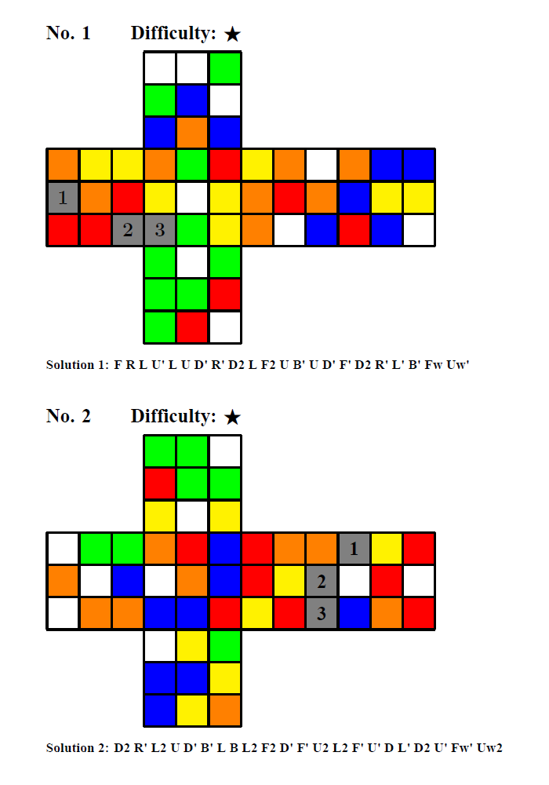
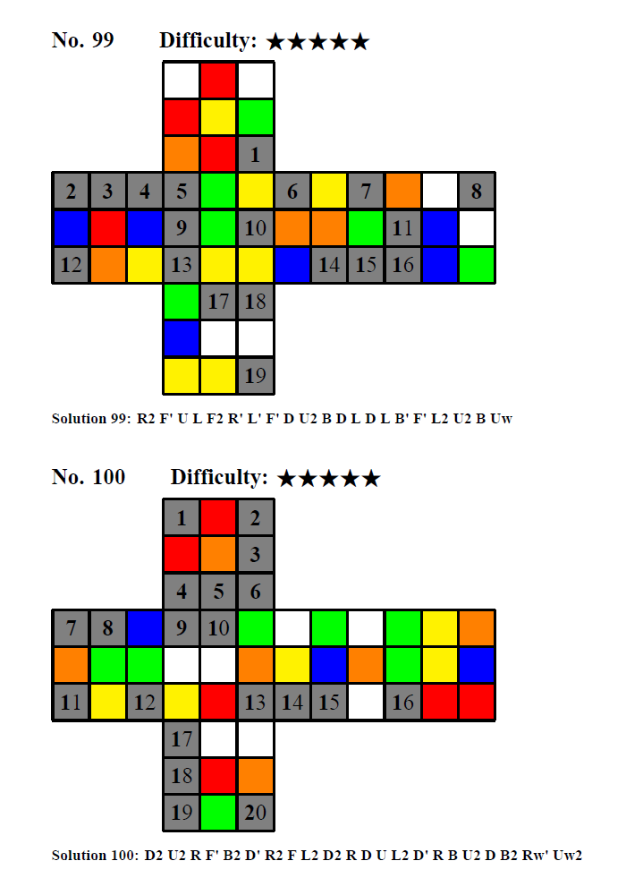

# CubeSudoku
## Rules
Cube Sudoku is to fill colors in a 3x3x3 Rubik's cube with the [Western color scheme](https://www.speedsolving.com/wiki/index.php/Western_Color_Scheme).  Once the puzzle is solved, this means that the state is solvable by legal moves (that is, without taking the cube apart again).

## Solutions

Each problem has only one solution. Solution can be accessed after each problem. You can apply the scramble in the solution to your Rubik's cube with yellow on the top and red on the front.

## Build and Run from Source

First of all, please install Python 3.7+, and download source code.

After that, you can change the random seed and scrambles to create new Cube Sudoku puzzles.

Then, for macOS or Linux users, open a Terminal and run:
```latex
python -u CubeSudoku.py > CubeSudoku.tex &
```

For Windows users:
Simply run `Cubesudoku.bat`

Finally, compile the `Cubesudoku.tex` file to `Cubesudoku.pdf` with `XeLaTex`

## PDF link

[Preview](https://github.com/nbwzx/CubeSudoku/blob/main/CubeSudoku.pdf)

[Download](https://github.com/nbwzx/CubeSudoku/raw/main/CubeSudoku.pdf)

## Apperance
<p align="center">


</p>
<br clear="left"/>

## Acknowledgement

Thanks to Xi'an Jiao Tong University Rubik's Cube Club, for providing the idea of "Cube Sudoku".

## Contributors

Zixing Wang

## License

MIT License